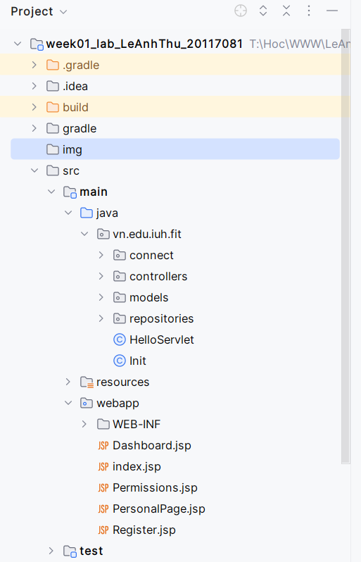
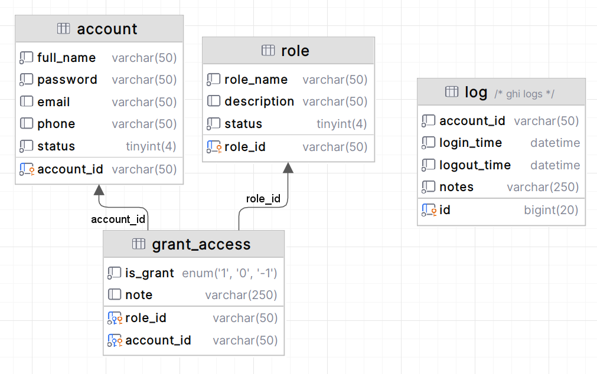

# week01_lab_LeAnhThu_20117081

Bài tập WWW lab week 01

## Project structure

## Database 

## Chức năng

- Thêm, cập nhật, xóa ở các đối tượng đã cho
- Đăng nhập
- Hiển thị thông tin tài khoản (nếu đăng nhập thành công)
- Hiển thị các quyền của một account.
- Hiển thị các account của một role
- Cấp quyền cho một account
- Ghi log mỗi lần account đăng nhập, đăng xuất.

## Khởi chạy

- Clone dự án
- Chạy file [week01_db_script] để tạo database
- Chạy file [Init] để khởi tạo 2 account
- Chạy Tomcat và xem tại http://localhost:8080
